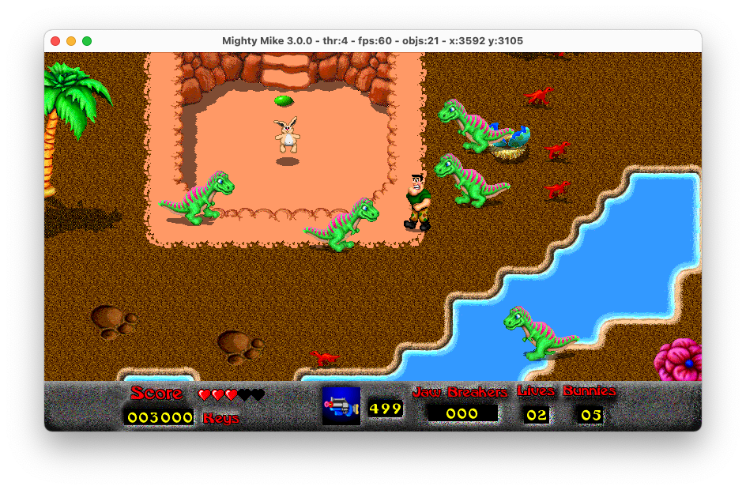

# Mighty Mike (a.k.a. Power Pete)

This is Pangea Software's **Mighty Mike** updated to run on modern systems.
Set in a toy store, this top-down action game is a staple of 90's Macintosh games.
It was initially published in 1995 under the name **Power Pete**.

**Download the game for macOS, Windows or Linux here:** https://github.com/jorio/MightyMike/releases

## About this update

Gameplay and graphics wise, this update aims to be as faithful to the original as possible.
It does bring a few enhancements, such as:

- Widescreen mode
- Framerate cap removal (with movement interpolation)
- Twin-stick gamepad controls

## Documentation

- [BUILD.md](BUILD.md) — How to build on macOS, Windows or Linux.
- [CHANGELOG.md](CHANGELOG.md) — Mighty Mike version history.
- [LICENSE.md](LICENSE.md) — Licensing information (see also below).
- [Instructions.pdf](docs/Instructions.pdf) — Mighty Mike 2.0 instruction manual.
- [Power Pete Survival Guide](docs/SurvivalGuide.pdf)
- [Mighty Mike Game Engine Information](docs/MightyMikeGameEngineInformation.md) (1997)
- Power Pete scans: [CD-ROM](docs/DiscArt.jpg), jewel case: [front](docs/DiscCaseFront.jpg), [back](docs/DiscCaseBack.jpg), [inside](docs/DiscCaseInsideLeft.jpg)

## License

Mighty Mike is being re-released here (https://github.com/jorio/mightymike)
under the [CC BY-NC-SA 4.0](LICENSE.md) license
with permission from Pangea Software, Inc.

© 1995-2000 Pangea Software, Inc. Mighty Mike is a trademark of Pangea Software, Inc.

This software includes portions © 2021 Iliyas Jorio.

## Related projects

Check out Christoph Leimbrock's Mighty Mike tools:

- [Power Pete Cheater 1.4](https://github.com/cyco/power-pete-cheater)
- [Mighty Resource Viewer](https://github.com/cyco/mighty-resource-parser)

If you like games by Pangea Software, I have made other ports you might enjoy:

- [Nanosaur](https://github.com/jorio/Nanosaur)
- [Bugdom](https://github.com/jorio/Bugdom)
- [Otto Matic](https://github.com/jorio/OttoMatic)
